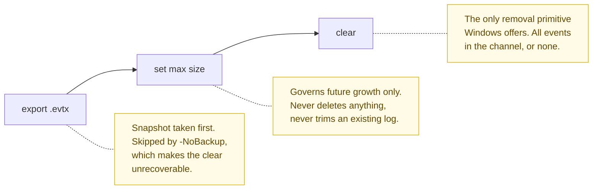

# dbj_event_logs_management

`Reset-EventLogs.ps1` 

1. back up
2. resize and 
3. clear 

Every Windows event log [channel](#vocabulary) on a machine, in that order.



Windows has no supported way to delete events specified by date. The only
removal primitive the OS offers is clear-the-whole-channel. This script does not
pretend otherwise: it takes a snapshot first, then wipes.

---

## Quick start

```powershell
.\Reset-EventLogs.ps1 --help        # what it does
.\Reset-EventLogs.ps1 -DryRun       # what it WOULD do, changes nothing
.\Reset-EventLogs.ps1 -BackupOnly   # snapshot only, destroys nothing
.\Reset-EventLogs.ps1               # the real thing (asks for YES)
```

### Why there are two files

Windows does not run a `.ps1` when you double-click it — it opens in an editor
instead. That is deliberate: a downloaded script should not execute on a stray
double-click. A `.bat` *does* run on double-click, so `Reset-EventLogs.bat`
exists to give you one.

It is a single line, and holds no logic of its own:

```bat
powershell -NoProfile -ExecutionPolicy Bypass -File "%~dp0Reset-EventLogs.ps1" %*
```

| Part | Why |
|---|---|
| `-ExecutionPolicy Bypass` | Sidesteps the policy that would otherwise refuse to run the script |
| `-NoProfile` | Ignores your PowerShell profile, so the run is not affected by local customisation |
| `%~dp0` | "The folder this `.bat` sits in" — it finds its `.ps1` whatever the current directory is |
| `%*` | Forwards every argument through |

Because of `%*`, the `.bat` is a full stand-in for the `.ps1`, not merely a
double-click shim:

```bat
Reset-EventLogs.bat --help
Reset-EventLogs.bat -DryRun
```

Use the `.bat` from Explorer, `cmd`, or Task Scheduler; call the `.ps1`
directly when you are already at a PowerShell prompt. Behaviour is identical —
all logic, the UAC elevation, and the `YES` gate live in the `.ps1`.

| Flag | Effect |
|---|---|
| `-h`, `--help` | Help then exit |
| `-v`, `--version` | Version then exit. |
| `-DryRun` | Report the plan. Changes nothing, needs no admin. |
| `-BackupOnly` | Export `.evtx` only. Nothing resized, nothing cleared. |
| `-NoBackup` | Skip the export. Logs become unrecoverable. |
| `-BackupTo <dir>` | Export destination. Default `.\Backups\<yyyy-MM-dd_HHmmss>`. |
| `-MaxSizeBytes <n>` | Cap per channel. Default `20MB`. Accepts `20MB`, `1GB`. |
| `-Force` | Skip the `YES` gate. Automation purpose. |

Reopen a backup with `Get-WinEvent -Path .\Backups\<stamp>\Security.evtx`, or
Event Viewer UI → Action → Open Saved Log.

---

## Vocabulary

**Channel** — in this context a named log stream that Windows writes events into. Each channel is its own container with its own file, size cap, and access rules.

The familiar ones appear in Event Viewer as Application, System, Security,
Setup, and Forwarded Events — the classic five. Behind them sits a much larger
set: the per-component channels named like
`Microsoft-Windows-PowerShell/Operational` or
`Microsoft-Windows-Kernel-Boot/Operational`, one or more per Windows component.
That is why the counts above are what they are — `wevtutil el` enumerates 1217
channels on `MYMACHINE`, and each is backed up, resized, and cleared in turn.

The word matters because the channel is the unit the OS actually operates on.
You can clear a channel; you cannot delete individual events inside one. That
is the constraint this script is built around.

---

Benevolent Dictator, Human Supervisor and Deep Inspirator: &copy; 2026 by dbj@dbj.org | MIT — see [LICENSE](LICENSE)